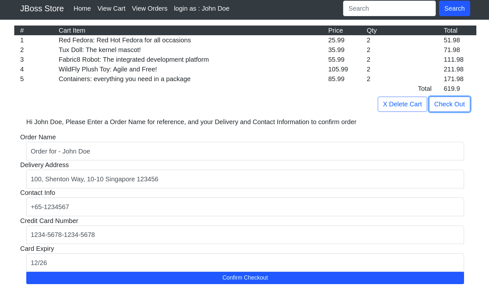

# jboss-store

Sample spring mvc ecommerce app to showcase running 'traditional' workloads on EAP images on OpenShift.

## Updated for OCP 4.5 EAP 7.2 and MySQL 5 images, change in application flows.


**TL;DR - To deploy the app**

Assuming the OCP environment already have the EAP / MYSQL Images and Templates in place

```
# oc new-project app

# oc create -f https://raw.githubusercontent.com/jboss-openshift/application-templates/master/secrets/eap7-app-secret.json -n app

# oc new-app eap72-mysql-persistent-s2i --name=jboss-store -p SOURCE_REPOSITORY_URL=https://github.com/wohshon/jboss-store -p SOURCE_REPOSITORY_REF=monolith-mvc -p DB_JNDI=java:jboss/datasources/storeDS -p CONTEXT_DIR=''
```

### Seed data

Some data are preloaded via JPA during the application startup to facilitate the running of this app

- Users, 3 users are created
- Products, 5 ficttious products are created
- Inventory, a initial stock level of 1000 are set for each product

### Using the demo

The app can be accessed via the route which is created during the deployment.

#### 1. Login Page


- use any of this 3 emails (and any passwords) to login
  - johnd@gmail.com
  - janed@gmail.com
  - jeff@gmail.com

The system does not check for any passwords, but will load the user based on the email from the database and inject it into the session. If user is not found, error message will be prompted. You can modify the `import.sql` to create additional users.

#### 2. Home page


- The home page, by default the system will load all the products into session, and display it on the home page, with form controls to add items to a shopping cart.
- Indicate the number of items in the form and click on `Add to Cart`.

#### 3. Shopping Cart


- Once item is added, a message will be promoted and the `View Cart` link will show up the number of items added.

- Click on `View Cart` to view the added items.


- The cart can be deleted by clicking on the `Delete Cart` button. (Currently the UI does not immediately removes the cart items, the page needs to be refreshed)
- Click on `Check Out` to display the confirmation button and additional form inputs.




- The delivery address and contact info will be pulled from the user database and pre populated in the form. Changes made on this form will be reflected on the delivery info and not on the Customer info.
- An order name can be entered to help differentiate different orders.
- The Credit card and expiry date info are not captured currently.
- Click on `Confirm Checkout` to submit the order


#### 4. Orders, Deliveries and Invoices


- Behind the scene, the system will create 
  - an `Order` and the `Order items` record.
  - update the `Inventory` stock level. Note that if the inventory is **out of stock**, user will be redirected back to the homepage, and the shopping cart items will be cleared from session.
  - a `Delivery` record, with a default delivery date one week later.
  - an `Invoice` record is generated, with an `ISSUED` status.
- Orders, Invoices and Deliveries info can be access at `View Orders` link


#### Additional info

- You can click on the `JBoss Store` link to return to login page
- `Search` function is not implemented
- No UI is implemented to check inventory for now, you can confirm the inventories are deducted via the database.


- JPA Configurations are maintained in this Spring Configuration pojo [here](src/main/java/com/demo/store/config/PersistenceJPAConfig.java)
